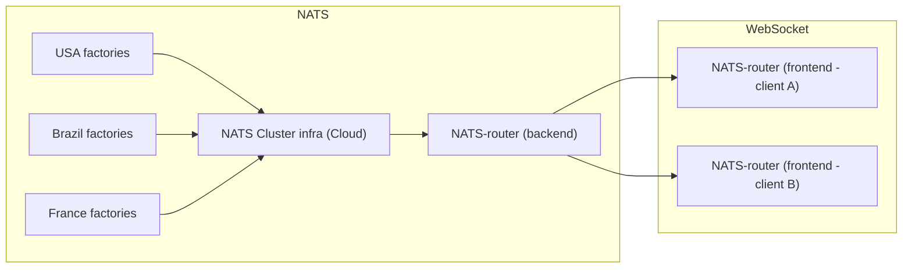
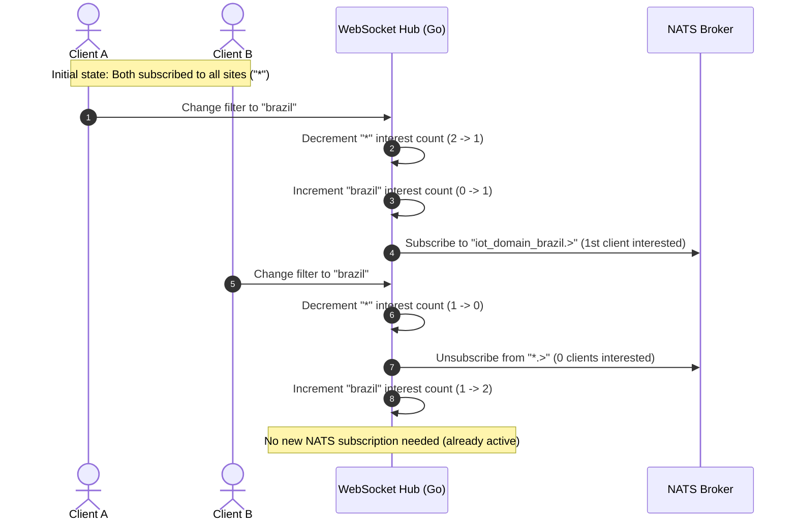

# NATS-Router Explorer

This is a tool designed to privide the user a way to visualize realtime messages and subject topology in a NATS architecture. To avoid having the user to directly connect into NATS, the project features a backend (Go) and a frontend (vanilla TypeScript) that, altogether, make the connections to NATS server-side and route the messages through websockets to active clients. The routing is done through a interest based system, making the backend subscribe where/when needed and share subscription between different clients.

In a real world scenario, this application helps a user to check the health of applicances in different factories/locations in a lightweight and safe manner. While the frontend shown here is a simple visualizer, it showcases one in many possibilities of this architecture and could/should be improved when applied in a corporation.

This fullstack architecture can also be used as an integration tool between different protocols. The backend could, in turn, obtain messages from MQTT or modbus, and route them to different clients through the web.

## 1. Features

* Hierarchical visualization of active topics, structuring paths automatically.
* The backend dynamically subscribes to NATS topics only when at least one connected client requires them, unsubscribing immediately when interest drops to zero.
* Tree branches flash (via CSS transitions) when children receive new messages, even if parent folders are collapsed.
* Detailed JSON viewer with custom syntax highlighting.

## 2. System Architecture

The following diagram illustrates the real-time telemetry data flow, from regional IoT devices, through the NATS Cloud Infrastructure, and down to multiple connected WebSocket clients:



The `nats.Service` struct encapsulates subscription tasks using a map protectively locked by a `sync.Mutex`. This prevents race conditions when multiple client connections invoke subscription changes concurrently.

The `websocket.Hub` maintains active TCP connections and spawns read and write pumps for each client. When client connections drop, the hub safely decrements reference counts, triggering garbage collection of dead NATS subscriptions, keeping the message broker clean.

When multiple clients connect, they share existing NATS subscriptions. The sequence diagram below shows how the backend dynamically establishes and terminates physical NATS subscriptions based on current client interest:



This architecture makes the message exchange on the NATS side efficient - we only subcribe when we have clients connected showing interest, while sharing a single subscription between multiple clients when needed. 

## 3. Directory Structure

```text
nats-router-explorer/
├── docker-compose.yml            # development docker compose environment
├── docker-compose.prod.yml       # production docker compose environment
├── README.md                     # documentation
├── frontend/                     # frontend project folder (Node/Vite)
│   ├── Dockerfile                # production Dockerfile (Nginx + static build)
│   ├── Dockerfile.dev            # development Dockerfile
│   ├── nginx.conf                # nginx reverse proxy configuration
│   ├── index.html                # entrypoint HTML document
│   ├── package.json              
│   ├── package-lock.json         
│   └── src/                      # frontend source code
│       ├── components/           # UI Components (topic tree rendering)
│       ├── services/             # WebSocket client service
│       ├── styles/               # CSS styling
│       ├── ui/                   # selection handlers and animations
│       └── script.ts             # frontend bootstrap
└── backend/                      # backend project folder (Go)
    ├── Dockerfile                # production Dockerfile
    ├── Dockerfile.dev            # development Dockerfile
    ├── cmd/
    │   ├── main.go               # main server entrypoint
        ├── simulator/            # simulator of IoT messages
        │   └── main.go               
    ├── go.mod                    
    ├── go.sum                    
    └── internal/
        ├── nats/                 # NATS Connection service
        └── websocket/            # webSocket service
```

## 4. Running the app

The applications run in development and production environments. 

The *dev* environment sets up a container running `vite run dev`, which provides a build free mode with live reload in typescript:

```bash
docker compose up --build -d
```

* **Frontend**: `http://localhost:8080` (Node/Vite development server).
* **Backend**: `http://localhost:3000` (Go live environment, container must be restarted when changing files).
* **NATS**: `nats://localhost:4222`

The *prod* environment creates containers with built binaries for backend and Nginx to serve static frontend files:

```bash
docker compose -f docker-compose.prod.yml up --build -d
```
* **Frontend**: `http://localhost` (Served via Nginx on standard port 80).
* **Backend**: `http://localhost:3000` (Go static binary).
* **NATS**: `nats://localhost:4222`

To simulate active IoT devices and test real-time visualization, launch the simulator script locally:

```bash
cd backend
go run ./cmd/simulator/main.go
```

By default, the simulator publishes mock telemetry data to various site topics on the NATS instance at `nats://localhost:4222` every 1.5 seconds. You can override defaults using flags:
* `-nats`: Define NATS connection URL
* `-interval`: Define publication interval (ex: `-interval 500ms`).

